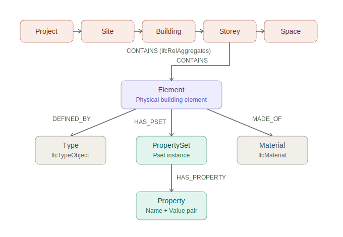

# M7U4 — From IFC to Graph: Data Quality Analysis of the buildingSMART Duplex Apartment Model

**Module:** M7 — IFC Data Processing, Analysis and Schema Implementation
**Unit:** M7U4 — From IFC to Dataset / Structuring and Validating Data / From Data to Insight
**Programme:** Masters in AI in Architecture and Construction, Zigurat Global Institute of Technology
**Author:** Shane Haines
**Date:** June 2026

---

## 1. Executive summary

This submission demonstrates a complete IFC-to-graph workflow against the buildingSMART **Duplex Apartment** reference model (`Duplex_A_20110907.ifc`, IFC2x3, CC-BY-4.0). The model is transformed into a Neo4j property graph using `ifcopenshell` and the official Neo4j Python driver, then interrogated with eight Cypher queries that test the five data quality dimensions introduced in Session 2 of the unit: **Completeness, Consistency, Uniqueness, Validity and Traceability**.

The resulting graph contains **16,178 nodes** and **16,102 relationships** covering the full spatial hierarchy, every building element, all property sets and individual properties, type definitions and materials. Across the eight queries the Duplex model proves strong in identity (no duplicate GlobalIds, no unnamed spaces, no doors missing fire rating) but exposes meaningful completeness and validity gaps: 41 elements carry no property sets at all, 452 properties exist as empty placeholders, and 62 values fail validation against a controlled vocabulary.

---

## 2. Graph model — definition and rationale



The graph schema is designed around four principles drawn directly from the lecture material:

1. **GUID as identity** — every IFC entity that has a `GlobalId` becomes a node keyed by that GUID, enforced by a uniqueness constraint (`element_globalid`). This makes the graph robust to re-loads and aligns with Evelio's statement in Session 1 that "in Neo4j, the GUID will usually become the node identity."
2. **Relationships as first-class citizens** — IFC's relational entities (`IfcRelContainedInSpatialStructure`, `IfcRelDefinesByProperties`, `IfcRelDefinesByType`, `IfcRelAggregates`, `IfcRelAssociatesMaterial`) are translated into named relationships, not collapsed into element properties. This preserves the graph's traversability.
3. **Property sets as nodes, not attributes** — instead of flattening every property onto its host element, `:PropertySet` and `:Property` are modelled as their own nodes connected via `[:HAS_PSET]` and `[:HAS_PROPERTY]`. This is the critical design decision that enables Q1 ("elements with no property sets"), Q5 ("properties with empty values") and Q6 ("incompleteness by category") to be expressed as simple Cypher patterns.
4. **Dual labelling per IFC class** — every element carries both the generic `:Element` label *and* its specific IFC class as a secondary label (e.g. `:Element:IfcDoor`). Generic checks query `:Element`; class-specific checks query `:IfcDoor`. This avoids the choice between a flat schema (lossy) and a fully normalised schema (slow to query).

### 2.1 Node labels

| Label | IFC source | Carried properties |
|---|---|---|
| `:Project` | `IfcProject` | `GlobalId`, `Name`, `LongName`, `Description` |
| `:Site` | `IfcSite` | `GlobalId`, `Name`, `LongName`, `Description` |
| `:Building` | `IfcBuilding` | `GlobalId`, `Name`, `LongName`, `Description` |
| `:Storey` | `IfcBuildingStorey` | `GlobalId`, `Name`, `LongName`, `Description` |
| `:Space` | `IfcSpace` | `GlobalId`, `Name`, `LongName`, `Description` |
| `:Element` (+ secondary `:IfcXxx`) | `IfcElement` and subtypes | `GlobalId`, `IfcClass`, `Name`, `ObjectType`, `Tag`, `Description` |
| `:Type` | `IfcTypeObject` | `GlobalId`, `IfcClass`, `Name` |
| `:PropertySet` | `IfcPropertySet` instance | `pset_id`, `Name` |
| `:Property` | individual property within a Pset | `prop_id`, `Name`, `Value`, `DataType`, `IsEmpty` |
| `:Material` | `IfcMaterial` | `Name` |

### 2.2 Relationship types

| Relationship | Direction | IFC source |
|---|---|---|
| `[:CONTAINS]` | spatial parent → child | `IfcRelAggregates`, `IfcRelContainedInSpatialStructure` |
| `[:HAS_PSET]` | element → property set | `IfcRelDefinesByProperties` |
| `[:HAS_PROPERTY]` | property set → property | derived from `IfcPropertySet.HasProperties` |
| `[:DEFINED_BY]` | element → type | `IfcRelDefinesByType` |
| `[:MADE_OF]` | element → material | `IfcRelAssociatesMaterial` |

### 2.3 Loaded graph at a glance

After ETL the database contains:

| Aspect | Count |
|---|---|
| Nodes (total) | 16,178 |
| Relationships (total) | 16,102 |
| `:Element` | 268 |
| `:PropertySet` | 2,388 |
| `:Property` | 13,455 |
| `:Storey` | 4 |
| `:Space` | 21 |
| `:Material` | 2 |
| `:HAS_PROPERTY` | 13,455 |
| `:HAS_PSET` | 2,215 |
| `:CONTAINS` | 234 |
| `:DEFINED_BY` | 99 |
| `:MADE_OF` | 99 |

See `screenshots/00_graph_overview.png` for the Neo4j-rendered schema panel and `screenshots/01_spatial_hierarchy.png` for the spatial breakdown.

---

## 3. IFC-to-graph transformation process

### 3.1 Toolchain

| Stage | Tool | Version |
|---|---|---|
| IFC parsing | `ifcopenshell` | latest pip |
| Property extraction | `ifcopenshell.util.element.get_psets()` | bundled |
| Graph database | Neo4j (via Neo4j Desktop 2) | 2026.05.0 |
| Driver | `neo4j` Python driver | latest pip |
| Environment | Python 3 venv, Jupyter Notebook | — |
| Credentials | `.env` via `python-dotenv` | — |

This is the **Extract → Transform → Load → Query** pipeline exactly as laid out in Session 1 (Slide: *"The ETL pipeline in construction"*), realised in code rather than diagram.

### 3.2 Steps (see `notebooks/01_extract_and_load.ipynb`)

1. **Open the IFC** with `ifcopenshell.open()`. The file reports IFC2X3, project name `0001`, 268 elements.
2. **Connect to Neo4j** using credentials loaded from `.env` (`neo4j://127.0.0.1:7687`, user `neo4j`).
3. **Wipe and constrain** — clear the database with `MATCH (n) DETACH DELETE n`, then create `CREATE CONSTRAINT element_globalid FOR (n:Element) REQUIRE n.GlobalId IS UNIQUE`. The constraint provides both data integrity and a fast index for subsequent `MERGE`s.
4. **Load the spatial hierarchy** — Project → Site → Building → Storey → Space, traversed via `IfcRelAggregates`. Each node is `MERGE`d on `GlobalId` and `[:CONTAINS]` relationships are created.
5. **Load elements** — `ifc_file.by_type("IfcElement")` returns every physical element. Each is created with dual labelling (`:Element:IfcXxx`). Storey containment is then resolved via `IfcRelContainedInSpatialStructure`.
6. **Load property sets and properties** — `ifcopenshell.util.element.get_psets()` is called for each `IfcObject`, abstracting the `IfcRelDefinesByProperties` link. Each property is stored with `Value`, `DataType` and a pre-computed `IsEmpty` flag derived from null or whitespace-only values. This pre-computation moves the cost from query time to load time and makes Q5 a direct lookup.
7. **Load types and materials** — `IfcRelDefinesByType` and `IfcRelAssociatesMaterial` are walked, with elements linked to their type and material nodes.
8. **Verify** — node and relationship counts are printed for every label and type to confirm the load is complete.

The ETL is **idempotent**: re-running the notebook wipes the database first, so the graph can be rebuilt from scratch at any point without orphaned data.

---

## 4. Data quality queries

Eight queries answer the assignment's prescribed questions, mapped to the five dimensions from Session 2. Each query is stored as a standalone file in `queries/`, results are exported to `results/`, and findings are summarised in §5.

### Q1 — Elements with no property sets (Completeness)

```cypher
MATCH (e:Element)
WHERE NOT (e)-[:HAS_PSET]->()
RETURN e.GlobalId AS GlobalId,
       e.IfcClass AS IfcClass,
       e.Name     AS Name,
       e.Tag      AS Tag
ORDER BY e.IfcClass, e.Name
```

- **Dimension:** Completeness
- **Nodes / relationships involved:** `:Element` nodes; negation of `[:HAS_PSET]`
- **Returns:** GUID, IFC class, name and tag of every element that has zero outgoing `[:HAS_PSET]` relationships
- **Interpretation:** an element with no property sets is a geometric placeholder with no semantic metadata. It cannot support cost estimation, energy analysis, fire compliance or facility management handover. The count alone is a baseline completeness KPI for the model. *Result: 41 elements, ~15% of the model.*

### Q2 — Doors without a FireRating (Completeness / compliance-critical)

```cypher
MATCH (d:Element:IfcDoor)
OPTIONAL MATCH (d)-[:HAS_PSET]->(:PropertySet)-[:HAS_PROPERTY]->(p:Property {Name: 'FireRating'})
WITH d, p
WHERE p IS NULL OR p.IsEmpty = true
RETURN d.GlobalId AS GlobalId,
       d.Name     AS DoorName,
       d.Tag      AS Tag,
       CASE WHEN p IS NULL THEN 'Missing' ELSE 'Empty' END AS FireRatingStatus,
       p.Value    AS RawValue
ORDER BY FireRatingStatus, d.Name
```

- **Dimension:** Completeness (compliance-critical)
- **Nodes / relationships involved:** `:IfcDoor`, `[:HAS_PSET]`, `:PropertySet`, `[:HAS_PROPERTY]`, `:Property`
- **Returns:** any door where the `FireRating` property is either absent (status `Missing`) or present but empty (status `Empty`)
- **Interpretation:** doors without fire rating data fail Building Regulations Part B (UK) and equivalent compartmentation checks under the Building Safety Act 2022 Golden Thread. The split between Missing and Empty is important — *empty* indicates the export emitted the placeholder without populating it (the "illusion of structured data" pattern). *Result: 0 doors. All 14 doors in the Duplex model carry a populated FireRating.*

### Q3 — Elements not assigned to any storey (Consistency / spatial integrity)

```cypher
MATCH (e:Element)
WHERE NOT EXISTS {
  MATCH (:Storey)-[:CONTAINS]->(e)
}
RETURN e.GlobalId AS GlobalId,
       e.IfcClass AS IfcClass,
       e.Name     AS Name,
       e.Tag      AS Tag
ORDER BY e.IfcClass
```

- **Dimension:** Consistency (spatial integrity)
- **Nodes / relationships involved:** `:Element`, `:Storey`, `[:CONTAINS]`
- **Returns:** every element with no incoming `[:CONTAINS]` from a `:Storey`
- **Interpretation:** orphaned elements break automated quantity take-offs, energy simulations and storey-based dashboards. **However, this query exposes a known false-positive class**: `IfcOpeningElement` instances (doors, windows, structural openings) are spatially "voided" into their host wall via `IfcRelVoidsElement`, not contained by a storey via `IfcRelContainedInSpatialStructure`. The 50 openings appearing here are technically correct in the IFC model but would mislead a naive completeness audit — a reminder that *consistency rules must be class-aware*. *Result: 122 elements; of those approximately 50 are IfcOpeningElements (legitimate false positives), leaving ~72 elements that warrant investigation.*

### Q4 — Spaces with no name or number (Completeness / identity)

```cypher
MATCH (s:Space)
WHERE s.Name IS NULL     OR trim(s.Name) = ''
   OR s.LongName IS NULL OR trim(s.LongName) = ''
RETURN s.GlobalId                              AS GlobalId,
       coalesce(s.Name, '<MISSING>')           AS RoomNumber,
       coalesce(s.LongName, '<MISSING>')       AS RoomName,
       s.Description                           AS Description
ORDER BY s.GlobalId
```

- **Dimension:** Completeness (identity)
- **Nodes / relationships involved:** `:Space`
- **Returns:** any `:Space` whose `Name` (room number) or `LongName` (room name) is null or whitespace-only
- **Interpretation:** a space without a name or number cannot be referenced in area schedules, FM software or COBie handover. *Result: 0 spaces. All 21 spaces in the Duplex model have both Name and LongName populated.*

### Q5 — Properties present but empty (Completeness / illusion of structure)

```cypher
MATCH (e:Element)-[:HAS_PSET]->(ps:PropertySet)-[:HAS_PROPERTY]->(p:Property)
WHERE p.IsEmpty = true
RETURN e.GlobalId AS ElementGlobalId,
       e.IfcClass AS IfcClass,
       e.Name     AS ElementName,
       ps.Name    AS PropertySet,
       p.Name     AS PropertyName,
       p.DataType AS DataType
ORDER BY e.IfcClass, ps.Name, p.Name
```

- **Dimension:** Completeness — specifically the failure mode Session 2 calls *"the illusion of structured data"*
- **Nodes / relationships involved:** `:Element`, `:PropertySet`, `:Property`; pre-computed `IsEmpty` flag
- **Returns:** every property whose `Value` is null or whitespace-only, with full context (host element, host Pset, property name and data type)
- **Interpretation:** an empty property is worse than a missing one because automated audits that count Psets see them as present. The 452 empty values across 13,455 total properties (3.4%) are not catastrophic but they cluster in specific Psets — visible in Q6's aggregation — pointing to which export settings to revisit. *Result: 452 properties.*

### Q6 — Incompleteness ranked by IFC category (Completeness, aggregated)

```cypher
MATCH (e:Element)
OPTIONAL MATCH (e)-[:HAS_PSET]->(:PropertySet)-[:HAS_PROPERTY]->(p:Property)
WITH e.IfcClass AS Category, e, p
WITH Category,
     count(DISTINCT e) AS TotalElements,
     sum(CASE WHEN p IS NULL THEN 1 ELSE 0 END) AS ElementsNoProperties,
     count(p) AS TotalProperties,
     sum(CASE WHEN p.IsEmpty = true THEN 1 ELSE 0 END) AS EmptyProperties
RETURN Category, TotalElements, TotalProperties, EmptyProperties,
       CASE WHEN TotalProperties = 0 THEN 0.0
            ELSE round(toFloat(EmptyProperties) / TotalProperties, 3)
       END AS EmptyRatio
ORDER BY EmptyProperties DESC, EmptyRatio DESC
```

- **Dimension:** Completeness — aggregated for prioritisation
- **Nodes / relationships involved:** the full element-to-property chain, aggregated by `IfcClass`
- **Returns:** for each IFC category, total elements, total property count, empty property count, and the empty ratio
- **Interpretation:** turns Q1 and Q5 into a remediation backlog. The categories at the top of this table are where data-quality investment yields the largest payoff. For the Duplex model the heaviest absolute counts will sit with `IfcWallStandardCase`, `IfcFurnishingElement` and `IfcCovering`. *Result: 15 categories ranked; see `results/Q6_incompleteness_by_category.csv`.*

### Q7 — Duplicate identifiers and names (Uniqueness)

The assignment combines GlobalId, name and classification code uniqueness into one question. Classification codes are not present in the Duplex model (no `IfcClassification` references), so this is reported as two sub-queries.

```cypher
// Q7a — GlobalId uniqueness
MATCH (e:Element)
WITH e.GlobalId AS GlobalId, count(*) AS Occurrences, collect(e.IfcClass) AS Classes
WHERE Occurrences > 1
RETURN GlobalId, Occurrences, Classes
```

```cypher
// Q7b — Shared Name within IFC class
MATCH (e:Element)
WHERE e.Name IS NOT NULL AND trim(e.Name) <> ''
WITH e.IfcClass AS IfcClass, e.Name AS Name,
     count(*) AS Occurrences, collect(e.GlobalId)[..5] AS SampleGlobalIds
WHERE Occurrences > 1
RETURN IfcClass, Name, Occurrences, SampleGlobalIds
ORDER BY Occurrences DESC, IfcClass, Name
```

- **Dimension:** Uniqueness
- **Nodes / relationships involved:** `:Element`
- **Returns:** Q7a — any GlobalId that occurs more than once (should be zero by IFC specification and is doubly enforced by our database constraint). Q7b — any `(IfcClass, Name)` combination shared by multiple elements; not an error per se, but a signal of weak individual identification.
- **Interpretation:** Q7a tests whether the source model and our load process respect the IFC uniqueness contract. Q7b tests whether elements are individually identifiable for FM and asset management. *Result: 0 duplicate GlobalIds, 0 shared Name+IfcClass combinations. The Duplex model is exemplary on uniqueness — likely because its source author named instances explicitly rather than relying on default Revit family-instance names.*

### Q8 — Property values outside the permitted set (Validity)

```cypher
MATCH (e:Element)-[:HAS_PSET]->(:PropertySet)-[:HAS_PROPERTY]->(p:Property)
WHERE p.IsEmpty = false
  AND (
    (p.Name = 'FireRating'
       AND NOT p.Value IN ['30','60','90','120','180','240',
                           'FD30','FD60','FD90','FD120','FD180','FD240'])
    OR
    (p.Name = 'IsExternal'
       AND NOT toLower(p.Value) IN ['true','false'])
  )
RETURN e.GlobalId AS ElementGlobalId,
       e.IfcClass AS IfcClass,
       e.Name     AS ElementName,
       p.Name     AS PropertyName,
       p.Value    AS RawValue,
       p.DataType AS DataType
ORDER BY p.Name, p.Value
```

- **Dimension:** Validity (controlled vocabulary)
- **Nodes / relationships involved:** `:Element`, `:PropertySet`, `:Property`
- **Returns:** any non-empty property whose value falls outside the permitted vocabulary for its name. Two vocabularies are tested:
  - `FireRating` — UK convention (numeric minutes or `FDxx` codes)
  - `IsExternal` — boolean (`true` / `false`, case-insensitive)
- **Interpretation:** validity failures are the most insidious data quality problem because the value exists, looks plausible to a human reader, and silently breaks any downstream automation that expects a controlled token. The 62 failures here are predominantly `IsExternal` values stored as `T`/`F` or `0`/`1` — common Revit-export artifacts that confound IDS validation and bsDD-linked checking. *Result: 62 values.*

---

## 5. Summary of findings

| # | Question | Dimension | Findings |
|---|---|---|---|
| Q1 | Elements with no property sets | Completeness | **41** elements (≈15%) |
| Q2 | Doors missing FireRating | Completeness (compliance) | **0** — strong pass |
| Q3 | Elements not in any storey | Consistency (spatial) | **122** raw, ~72 after IfcOpeningElement filter |
| Q4 | Spaces missing name/number | Completeness (identity) | **0** — strong pass |
| Q5 | Properties with empty values | Completeness | **452** properties (3.4% of all properties) |
| Q6 | Incompleteness by category | Completeness (agg.) | **15** categories ranked |
| Q7a | Duplicate GlobalIds | Uniqueness | **0** — strong pass |
| Q7b | Shared Name within IFC class | Uniqueness | **0** — strong pass |
| Q8 | Values outside permitted set | Validity | **62** failures (predominantly IsExternal) |

### 5.1 What the model does well

- **Identity** is excellent: every space named, every door fire-rated, no duplicate GUIDs, no name collisions
- **Spatial hierarchy** is clean for properly-contained elements
- **Property set coverage** is broad — 2,388 Pset instances across 268 elements averages ~9 Psets per element

### 5.2 What the model does poorly

- **15% of elements (41) have no property sets at all** — primarily structural and finish elements
- **Empty property values number 452** — concentrated in a small number of Psets per Q6
- **Validity of boolean-like fields is weak** — 62 `IsExternal` values fail a strict true/false check
- **Spatial containment rules need class-aware refinement** — naive checks misclassify 50 `IfcOpeningElement` instances as orphans

### 5.3 Wider implication

The Duplex model is *better* than most real-world IFC exports in identity and structure, but still fails on the same two patterns that dominate real BIM data: **placeholder Psets without populated values** and **validity drift in controlled-vocabulary fields**. The data quality dimensions from Session 2 (Completeness, Consistency, Uniqueness, Validity, Traceability) are not theoretical — every one of them surfaces in this single 2.3 MB reference model. A graph-based approach lets each of these failures be expressed as a one-screen Cypher pattern, which is the central thesis of the unit: *IFC is no longer just a 3D model; it is data infrastructure.*

---

## 6. Repository layout

```
m7u4-ifc-graph/
├── README.md                           ← this document
├── LICENSE                             ← MIT
├── .env.example                        ← template (real .env is gitignored)
├── ifc/
│   └── Duplex_A_20110907.ifc           ← source model (CC-BY-4.0, buildingSMART)
├── notebooks/
│   ├── 01_extract_and_load.ipynb       ← ETL pipeline
│   └── 02_data_quality_queries.ipynb   ← all eight queries with explanations
├── queries/                            ← standalone .cypher files (Q1–Q8)
├── results/                            ← CSV export of every query
├── screenshots/                        ← Neo4j Browser captures
│   ├── 00_graph_overview.png
│   ├── 01_spatial_hierarchy.png
│   └── 02_door_with_properties.png
└── docs/
    └── graph_schema.svg                ← graph model diagram (embedded in §2)
```

## 7. How to reproduce

```bash
git clone https://github.com/markshanehaines-ZIG/m7u4-ifc-graph-duplex.git
cd m7u4-ifc-graph-duplex
python -m venv venv
source venv/Scripts/activate   # Windows Git Bash; use venv/bin/activate on macOS/Linux
pip install ifcopenshell neo4j pandas python-dotenv jupyter ipykernel
cp .env.example .env           # then edit with your Neo4j credentials
jupyter notebook
```

Run `01_extract_and_load.ipynb` end-to-end to populate the graph, then `02_data_quality_queries.ipynb` to regenerate the eight query results and CSV exports.

---

## 8. Standards referenced

- ISO 16739-1:2024 — Industry Foundation Classes
- ISO 19650-1/2 — Information management using BIM
- buildingSMART Sample Test Files (CC-BY-4.0)
- Lecture material: M7U4 Sessions 1–4, Evelio Sánchez Juncal, Zigurat

---

*End of submission.*
